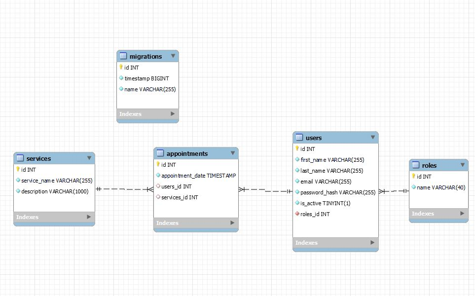

# Old Ink api 🎨

Welcome to the Old Ink's api documentation. This api recreates a fictional database where clients can register, log and create appointments with the different services that the tattoo studio provides.

## Table of Contents 📂
* <a href="#stack-⚓">Stack ⚓</a>
* <a href="#database-mysql-🌐">DataBase MySQL 🌐</a>
* <a href="#local-installation-💻">Local installation 💻</a>
* <a href="#routes-👾">Routes 👾</a>
* <a href="#author-✒️">Author ✒️</a>
* <a href="#acknowledgements-🙏">Acknowledgements 🙏</a>

## Stack ⚓


%20%20-%20purple)


## DataBase MySQL 🌐


## Local installation 💻
1. Clone the repository
 ` $ git clone https://github.com/ariusvi/backend_services `
2. Install dependencies
 ``` $ npm install --y ``` 
3. Start Express on the server
 ``` $ npm run dev ```
4. Run migrations
 ``` $ npm run run-migrations ``` 

5. The <b>HTTP folder</b> includes all routes that can be imported into Thunder Client

## Routes 👾
The routes worked for the project are:

<B>AUTHENTICATION (AUTH)</B>

- Register a user.
```POST /api/auth/register``` 
body: <br>
```json
{
  "first_name": "name",
  "last_name": "surname",
  "email": "email@email.com",
  "password": "123456"
} 
```
- Login user:<br>
```POST /api/auth/login```
body: <br>
```json
{
    "email": "user@email.com",
    "password": "123456"
} 
```

<B>USERS</B>
User routes include:

- Get all system users being Super_admin <br>
Login as superadmin: 
```POST /api/auth/login```

body: 

```json
{
    "email": "superadmin@email.com",
    "password": "123456"
} 
```
auth:

```token```

get all users:
```GET /api/users```

auth:

```token```

- View user profile

```GET /api/users/profile```

auth:

```token```

- Edit username

```PUT /api/users/profile```

auth:

```token```


<B>SERVICES</B>
Service routes include:

- See all services

```GET /api/services```


<B>APPOINTMENTS</B>
Appointment routes include:

- Create a new appointment

```POST /api/appointments```

body: 

```json
{
    "serviceId": "4",
    "dateAppointment": "2024-03-04 13:30:00"
} 
```
auth:

```token```

- See your appointments

```GET /api/appointments```

body: 

```json
{
    "id":"4"
} 
```

auth:

```token```

- See the appointment by id

```GET /api/appointments/:id```

body: 

```json
{
    "id":"12"
} 
```

auth:

```token```

- Update an appointment

```PUT /api/appointments```

body: 

```json
{
    "serviceId": "1",
    "userId": "4"
} 
```

auth:

```token```


## Author ✒️
* Ana Rius - student FSD
    * [GitHub](https://github.com/ariusvi)

## Acknowledgements 🙏
Special thanks to Daniel Tarazona for his incredible work as a teacher and above all for his infinite patience in helping to resolve any doubts and calm the panic.<br>
Thanks to my classmates:<br>
Pedro for his patience and help, especially to confirm that I understand things.<br>
Marina for her moral support, joint laughter and tears, as well as her help.